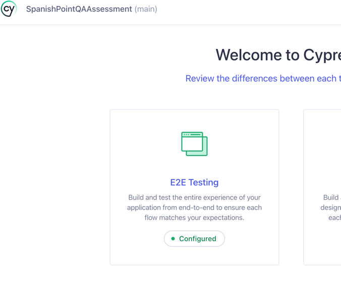
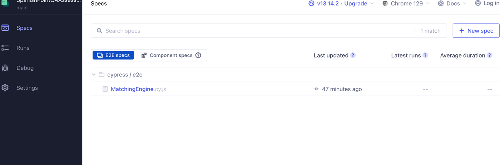
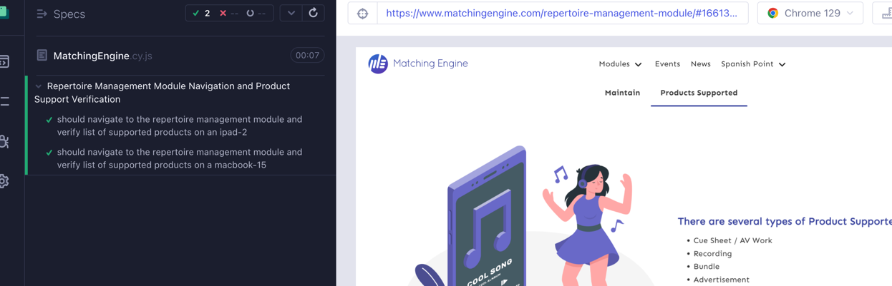
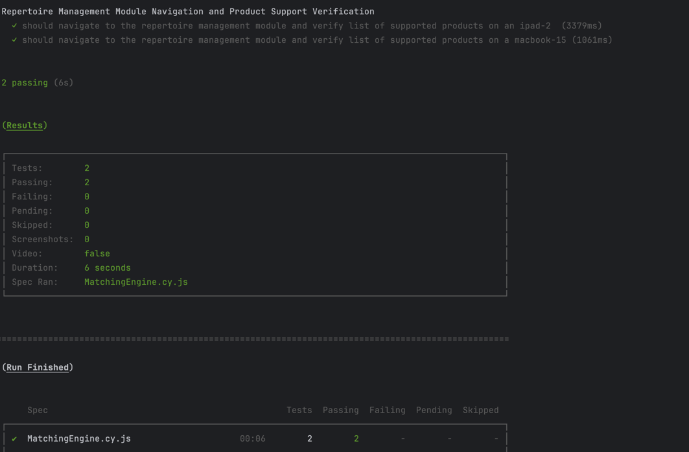
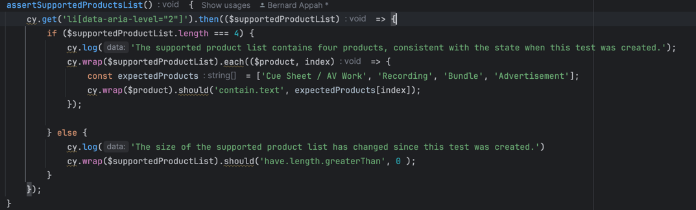

# Spanish Point Assessment
---

## Overview
An automation solution that employs Cypress to perform the following actions:
+ Visit https://www.matchingengine.com/
+	Expand ‘Modules’ in the header section
+	Click ‘Repertoire Management Module’ from the menu
+	Scroll to the ‘Additional Features’ section
+	Click ‘Products Supported’
+	Assert on the list of supported products under the heading ‘There are several types of Product Supported:’

---

## Installation
+ First step would involve cloning the repo by employing the following command
  
  ```
  git clone https://github.com/bernardAppah/SpanishPointAssessment.git
  ```
  
+ Navigate into the project directory if not already on it.
+ Ensure you have Node.js installed. You can check this by running:
  ```
  node -v
   ```
+ Install the necessary packages using npm:
   ```
   npm install
   ```
+ If you have the Cypress test runner, you can run the test with the following command
   ```
   npx cypress open --browser chrome
   ```
  
  
  

+ Alternatively, you can  do a headless run of the test with the following command:
   ```
  npx cypress run --browser chrome --spec "cypress/e2e/MatchingEngine.cy.js"
  ```
  

---

## Solution decisions
I have implemented the automated tests using the **Page Object Model** design pattern, which enhances code reusability and maintainability.

Additionally, I conducted the tests using two different viewports to ensure comprehensive coverage for responsiveness.

To increase robustness, I made an effort to minimize the use of IDs and classes as selectors, given their propensity to change. However, there were specific cases where using them was unavoidable.

For the assertion on the list of supported products under the heading *“There are several types of Product Supported:”*, I opted to verify that the list contains more than zero items, even though there are currently four items. This approach was intentional to future-proof the test against any changes in the number of supported products.

 


